# DCSS Guideline Calculator Forms Utility

A streamlined BAMOE 9.3.x compatible forms application for California Child Support Guideline calculations.

## 🚀 Quick Start (Windows)

### Prerequisites
- **Java 17** (OpenJDK or Oracle JDK)
- **Node.js 18+** and **npm**
- **Git**

### 1. Clone Repository


### 2. Install Dependencies
```bash
npm install
```

### 3. Build Forms
```bash
npm run build
```

### 4. Start Application
```bash
mvnw.cmd quarkus:dev
```

### 5. Access Forms
- **Children Count Form**: http://localhost:8080/forms/dcss-children-form.html
- **Dependent Info Form**: http://localhost:8080/forms/dcss-dependent-form.html
- **BAMOE Dev UI**: http://localhost:8080/q/dev-ui/extensions

## 📋 What This Includes

### ✅ Core Components
- **TypeScript React Forms** with PatternFly 5.x UI components
- **BAMOE 9.3.x Process Engine** with BPMN workflow
- **Child Support Calculation Service** (CA Family Code §4055)
- **MySQL Database Integration** (to be configured)
- **Kafka Integration** (to be configured, for event streaming)

### ✅ Build System
- **webpack** for TypeScript compilation
- **Maven** for Java/Quarkus build
- **PatternFly 5.x** enterprise UI components

### ✅ Forms Features
- **Children Count Input** (1-20 children)
- **Parent Income Entry** (gross income with automatic net calculation)
- **Custody Percentage** (time share between parents)
- **Dependent Details** (names, DOB, special needs)
- **Real-time Validation** and calculation preview

## 🔧 Configuration

### Database (Optional)
Update `src/main/resources/application.properties`:
```properties
quarkus.datasource.db-kind=mysql
quarkus.datasource.jdbc.url=jdbc:mysql://localhost:3306/dcss_db
quarkus.datasource.username=your_username
quarkus.datasource.password=your_password
```

### Kafka (Optional)
For event streaming:
```properties
kafka.bootstrap.servers=localhost:9092
```

## 🏗️ Project Structure


## 🎯 Usage Workflow

```mermaid
sequenceDiagram
    participant U as User
    participant F as React Forms
    participant B as BAMOE Process
    participant S as Calculation Service
    participant D as Database

    U->>F: Access Children Count Form
    F->>B: Submit children count (1-20)
    B->>B: Validate input range
    B->>F: Display Dependent Info Form

    U->>F: Enter parent incomes & custody %
    U->>F: Enter dependent details
    F->>B: Submit dependent information
    B->>B: Process form data

    B->>S: Execute calculation service
    S->>S: Apply CA Family Code §4055
    S->>S: Calculate K-factor & amounts
    S->>B: Return calculated results

    B->>D: Store calculation results
    B->>F: Display final child support amount
    F->>U: Show calculation breakdown

    Note over U,D: Optional: Persist to MySQL & publish to Kafka
```



## 🔍 Troubleshooting

### Build Issues
```bash
# Clean and rebuild
mvnw.cmd clean
npm run build
mvnw.cmd quarkus:dev
```

### Port Conflicts
```properties
# Change port in application.properties
quarkus.http.port=8081
```

### Database Connection
```bash
# Ensure MySQL is running
# Update connection details in application.properties
```

## 📚 Technical Details

### 🏛️ System Architecture


### 🔄 BPMN Process Flow


### 🚀 Deployment Architecture


### 🛠️ Technology Stack

- **Framework**: Quarkus 3.20.x with BAMOE 9.3.x
- **UI**: React 18 + TypeScript + PatternFly 5.x
- **Process Engine**: jBPM/Drools for BPMN execution
- **Database**: MySQL 8.x (optional)
- **Build**: Maven + webpack
- **Java**: OpenJDK 17

## 🤝 Support

For issues or questions:
- Check application logs: `tail -f target/quarkus.log`
- BAMOE Dev UI: http://localhost:8080/q/dev-ui/extensions
- Process instances: Check database or logs

---

**Ready for Windows deployment!** 🎉