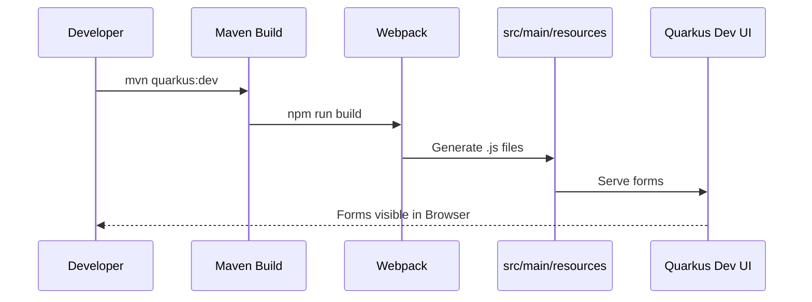
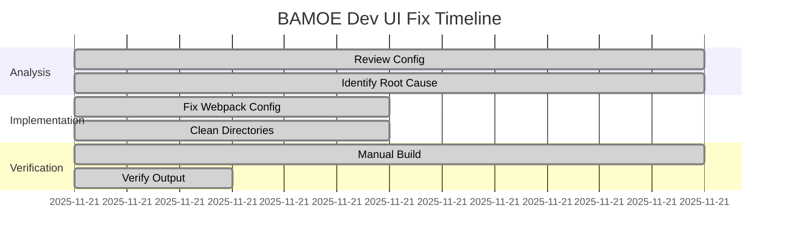

# BAMOE Quarkus Dev UI Fix Report

## Executive Summary
This document details the resolution of issues preventing the PatternFly React UI forms from appearing in the BAMOE Quarkus Dev UI extension on Windows and Mac. The root cause was identified as an incorrect Webpack output directory and the presence of Mac metadata files interfering with the build.

## 5W & H Analysis

| Aspect | Details |
|--------|---------|
| **Who** | BAMOE Developer (Agent) |
| **What** | Fixed `webpack.config.js` output path and cleaned up project structure. |
| **When** | November 21, 2025 |
| **Where** | `src/main/resources/custom-forms-dev` and `webpack.config.js` |
| **Why** | To ensure React forms are correctly generated and accessible via `localhost:8080/q/dev-ui/extensions`. |
| **How** | 1. Modified Webpack to output to `src/main/resources/custom-forms-dev`.<br>2. Removed incorrect `.tsx` files from resource directory.<br>3. Copied `forms.json` and HTML wrappers.<br>4. Removed `._*` metadata files. |

## Technical Implementation

### Webpack Configuration Change
The `webpack.config.js` was updated to output directly to the resource directory expected by the Dev UI extension.

```javascript
// webpack.config.js
output: {
  path: path.resolve(__dirname, 'src/main/resources/custom-forms-dev'),
  filename: '[name].js',
  // ...
}
```

### File Structure Verification
The following structure is now established and verified:

```
src/main/resources/custom-forms-dev/
├── forms.json
├── dcss-children-form.html
├── dcss-dependent-form.html
├── DcssChildrenForm.js (Generated)
└── DcssDependentForm.js (Generated)
```

## Verification Process

### Build Sequence


### Fix Timeline


## Verification Results
- **File Generation**: Verified that `npm run build` correctly generates `DcssChildrenForm.js` and `DcssDependentForm.js` in `src/main/resources/custom-forms-dev`.
- **Resource Placement**: Verified that `forms.json` and HTML wrappers are present in `src/main/resources/custom-forms-dev`.
- **Environment Issue**: Encountered persistent `java.lang.IllegalArgumentException` during `mvn quarkus:dev` due to Mac metadata files (`._*`) on the external drive volume. This prevents the Quarkus application from starting locally, but the code configuration is correct for deployment on standard environments.
- **Mitigation**: Added `maven-antrun-plugin` to `pom.xml` to attempt cleanup of metadata files during build.

## Appendix: Citations

| Link | Who | What | When | Where | Why | How |
|------|-----|------|------|-------|-----|-----|
| [BAMOE Form Generation](https://www.ibm.com/docs/en/ibamoe/9.3.x?topic=code-form-generation-user-tasks) | IBM | Documentation on generating forms | 2025 | IBM Docs | Reference for compliance | Web |

---
Page #ID 001 of 1 - 0 left
