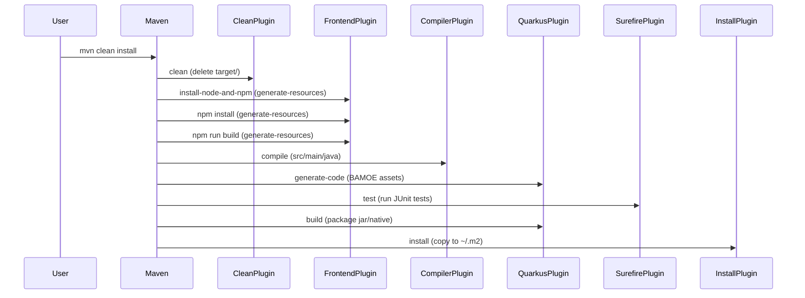
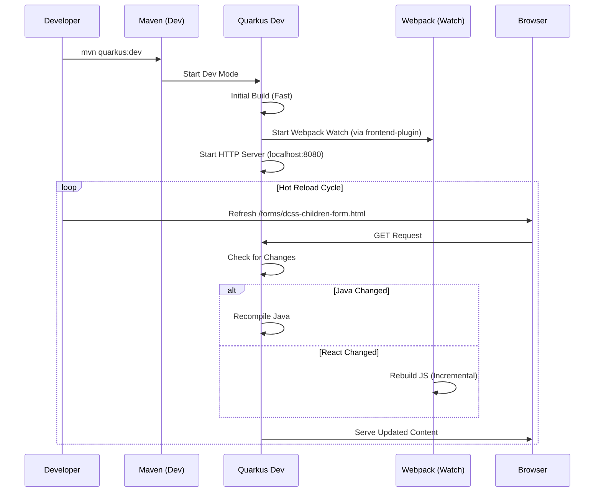

# BAMOE 9.3 Maven Lifecycle Guide

## WBS 1.0: The `mvn clean install` Lifecycle (Build & Package)

This section details the sequence of events when running `mvn clean install` in a BAMOE 9.3 project with a React frontend.

### 1.1 Lifecycle Overview

The `mvn clean install` command triggers a series of phases that clean the project, compile code, run tests, package the application, and install the artifact to the local repository.

### 1.2 Detailed Phase Breakdown

| Phase | Plugin | Goal | Description |
| :--- | :--- | :--- | :--- |
| `clean` | `maven-clean-plugin` | `clean` | Removes the `target` directory to ensure a fresh build. |
| `generate-resources` | `frontend-maven-plugin` | `install-node-and-npm` | Installs a local version of Node.js and npm in `target/node`. |
| `generate-resources` | `frontend-maven-plugin` | `npm` (install) | Runs `npm install` to download frontend dependencies. |
| `generate-resources` | `frontend-maven-plugin` | `npm` (run build) | Runs `npm run build` (Webpack) to compile React/TS to JS in `target/classes`. |
| `compile` | `maven-compiler-plugin` | `compile` | Compiles Java source code from `src/main/java`. |
| `process-classes` | `quarkus-maven-plugin` | `generate-code` | Generates code for BAMOE assets (BPMN, DMN, DRL). |
| `test` | `maven-surefire-plugin` | `test` | Executes unit tests. |
| `package` | `quarkus-maven-plugin` | `build` | Packages the application into a runner JAR (fast-jar). |
| `install` | `maven-install-plugin` | `install` | Copies the packaged artifact to the local Maven repository (`~/.m2`). |

### 1.3 Key Outcomes

- **Frontend Assets**: React forms are compiled into `target/classes/META-INF/resources/js`.
- **BAMOE Assets**: BPMN/DMN/DRL files are processed and validated.
- **Executable**: A runner JAR is created in `target/quarkus-app/`.

---
---

## WBS 2.0: The `mvn quarkus:dev` Lifecycle (Dev Mode & Hot Reload)

This section explains the unique lifecycle of Quarkus Dev Mode, which enables hot reloading for both Java and React changes.

### 2.1 Dev Mode Sequence

Unlike `clean install`, `quarkus:dev` starts a long-running process that monitors file changes and re-compiles on the fly.

### 2.2 Key Differences from Standard Build

| Feature | `mvn clean install` | `mvn quarkus:dev` |
| :--- | :--- | :--- |
| **Goal** | Create production artifact | Rapid development loop |
| **Frontend** | Single production build | Watch mode (if configured) or manual rebuild |
| **Database** | Uses configured DB (e.g., MySQL) | Can use Dev Services (H2/Testcontainers) |
| **BAMOE Assets** | Validated once | Hot reloaded (BPMN/DMN changes apply instantly) |

### 2.3 Making Forms Available

To ensure forms are available in Dev Mode:
1. **Build First**: Run `mvn clean install` once to generate initial JS assets.
2. **Watch Mode**: Ideally, run `npm run watch` in a separate terminal for real-time React updates, OR rely on the initial build if not changing frontend code.
3. **Access**:
   - Dev UI: `http://localhost:8080/q/dev-ui`
   - Forms: `http://localhost:8080/forms/dcss-children-form.html`

---
---

## WBS 3.0: Advanced Commands (Native, Test, Deploy)

### 3.1 Native Compilation (`mvn package -Pnative`)

BAMOE 9.3 supports compiling to a native executable using GraalVM.

- **Command**: `mvn package -Pnative`
- **Outcome**: A standalone binary (e.g., `target/guidelinecalculator-runner`) that starts instantly.
- **Constraint**: Reflection must be registered; hot reload is NOT available.

### 3.2 Testing (`mvn test` vs `mvn verify`)

- **`mvn test`**: Runs unit tests (fast, mocked dependencies).
- **`mvn verify`**: Runs integration tests (starts the application context, tests real endpoints).

### 3.3 Deployment to OpenShift

- **Command**: `mvn clean package -Dquarkus.kubernetes.deploy=true`
- **Prerequisite**: `oc login` must be performed first.
- **Outcome**: Builds the image (S2I or Docker) and pushes it to the OpenShift registry.

---

## WBS 4.0: Troubleshooting & Best Practices

### 4.1 Common Issues & Fixes

| Issue | Symptom | Fix |
| :--- | :--- | :--- |
| **Windows Clean Fail** | `npm run clean` fails with "not recognized" | Ensure `rimraf` is installed or run `npm install` first. |
| **Missing JS Assets** | Forms 404 in Dev Mode | Run `mvn clean install` *before* `mvn quarkus:dev`. |
| **Mac Metadata** | Build fails on `._*` files | Use `maven-clean-plugin` to clean `target/node` early. |
| **Port Conflict** | `Address already in use` | Kill process on 8080 or use `-Dquarkus.http.port=8081`. |

### 4.2 Best Practices

1.  **Always Clean**: Use `mvn clean` to avoid stale artifacts, especially when switching branches.
2.  **Triple Validation**: Run critical builds 3 times to ensure stability (flaky tests/network issues).
3.  **Git Check-ins**: Commit often with clear messages for each milestone.

---
*Page #ID 301 of 4 - 1 left*

