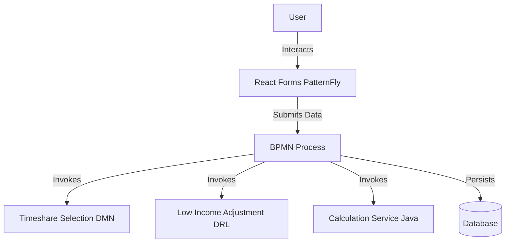
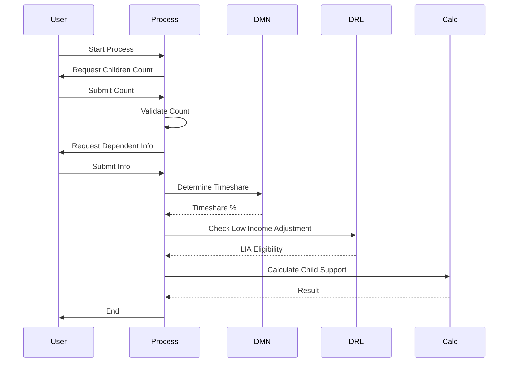

# Guideline Calculator Project Overview

## 1. Introduction
The Guideline Calculator is a BAMOE 9.3 business application designed to calculate child support based on California guidelines. It utilizes a BPMN process to orchestrate the flow, React forms for user interaction, and DMN/DRL for business rules.

## 2. Architecture

## 3. Process Flow

## 4. Code Inventory
| File Path | Type | Generated? | Description |
| :--- | :--- | :--- | :--- |
| `src/main/resources/processes/guidelinecalculator.bpmn` | BPMN | No | Main process definition. |
| `src/main/resources/custom-forms-dev/dcss-children-form.tsx` | React | No | Form for entering number of children. |
| `src/main/resources/custom-forms-dev/dcss-dependent-form.tsx` | React | No | Form for entering dependent and financial info. |
| `src/main/resources/gov/ca/dcss/guidelinecalculator/LowIncomeAdjustment.drl` | DRL | No | Rule for Low Income Adjustment. |
| `src/main/resources/gov/ca/dcss/guidelinecalculator/TimeshareSelection.dmn` | DMN | No | Decision logic for timeshare percentage. |
| `src/main/resources/application.properties` | Config | No | Application configuration. |
| `pom.xml` | Config | No | Project dependencies. |

## 5. Rules Detail
### Low Income Adjustment (DRL)
- **Logic**: Checks if Net Disposable Income is below $1500.
- **Outcome**: Prints eligibility message (can be extended to set a variable).

### Timeshare Selection (DMN)
- **Inputs**: Standard Visitation, Holidays, Vacation days.
- **Logic**: `(Standard + Holidays + Vacation) / 365 * 100`.
- **Outcome**: Timeshare Percentage.
