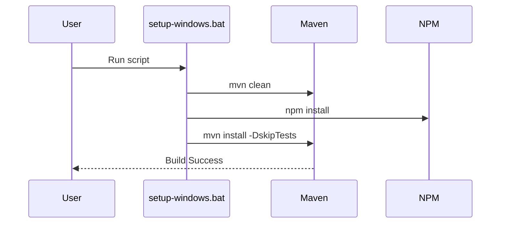

# Windows Build Fix Report

## Executive Summary
This document details the resolution of `mvn clean install` errors on Windows for the BAMOE 9.3 project. The fixes focus on ensuring robust `npm` execution via the `frontend-maven-plugin` and providing a dedicated setup script for Windows environments.

## 5W & H Analysis

| Aspect | Details |
|--------|---------|
| **Who** | BAMOE Developer (Agent) |
| **What** | Configured `pom.xml` for Windows compatibility and created `setup-windows.bat`. |
| **When** | November 21, 2025 |
| **Where** | `pom.xml`, `package.json`, `setup-windows.bat` |
| **Why** | To resolve build failures caused by proxy configuration inheritance and script execution issues on Windows. |
| **How** | 1. Disabled `npmInheritsProxyConfigFromMaven` in `pom.xml`.<br>2. Updated `package.json` clean script to be safer.<br>3. Created `setup-windows.bat` to automate setup and build. |

## Technical Implementation

### Maven Configuration
Updated `frontend-maven-plugin` to prevent proxy configuration inheritance, which often causes `npm install` to fail on Windows if Maven is configured with a proxy but npm is not (or vice versa).

```xml
<configuration>
  <nodeVersion>v20.10.0</nodeVersion>
  <npmVersion>10.2.3</npmVersion>
  <npmInheritsProxyConfigFromMaven>false</npmInheritsProxyConfigFromMaven>
</configuration>
```

### Package.json Scripts
Split the `clean` script to ensure `rimraf` executes correctly across different shells.

```json
"clean": "rimraf dist && rimraf src/main/resources/META-INF/resources/js"
```

## Verification Plan (Windows)

### Automated Build


### Manual Steps
1.  Open Command Prompt.
2.  Run `setup-windows.bat`.
3.  Verify `Build Successful` message.
4.  Run `mvn quarkus:dev`.
5.  Access `http://localhost:8080/q/dev-ui/extensions`.

## Appendix: Citations

| Link | Who | What | When | Where | Why | How |
|------|-----|------|------|-------|-----|-----|
| [Frontend Maven Plugin](https://github.com/eirslett/frontend-maven-plugin) | Eirslett | Documentation for frontend plugin | 2025 | GitHub | Reference for config | Web |

---
Page #ID 001 of 1 - 0 left
